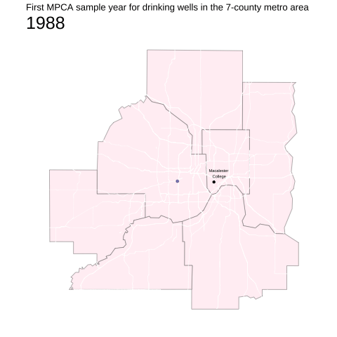

```{r setup, include=FALSE}
knitr::opts_chunk$set(echo = TRUE)
```

```{r}
library(tidyverse)
library(sf)
library(lubridate)
library(gganimate)
library(ggtext)
library(showtext)
library(ggalt)
font_add_google("Architects Daughter")
showtext_auto()
county_boundaries <- st_read("data/shp_bdry_counties_in_minnesota/mn_county_boundaries_500.shp")
```

# Station Information

Load in station information for all stations tracking domestic and public drinking with at least one sample.

```{r}
stationList <- read_csv("https://services.pca.state.mn.us/api/v1/groundwater/monitoring-stations?stationType=Well&format=csv") %>%
  filter(stationPurpose %in% c("Domestic Drinking", "Public Drinking"), sampleCount>0) 
```

Filter out stations missing a location and set CRS for both county boundaries and the station locations to be NAD83.

```{r}
station_points <- stationList %>% 
  filter(lat > 0, long <0) %>%
  st_as_sf(coords = c("long", "lat"), crs = "NAD83")

county_boundaries <- st_transform(county_boundaries, crs = "NAD83")
```

Check out where stations are located in MN

```{r}
ggplot() +
  geom_sf(data = county_boundaries, fill = "white") +
  geom_sf(data = station_points, color = "cadetblue", alpha = 0.3) +
  theme_minimal()+
  theme(axis.text = element_blank(), 
        panel.grid = element_blank())
```

Join county boundaries with the station locations. This will tell us what county each station is located in. Eventually we may want to do this on the census tract level. Filter for stations in the 7-county metropolitan area.

```{r}
stations7county <- 
  st_join(station_points, county_boundaries) %>% 
  select(endYear, resultCount, sampleCount, siteList, startYear, stationId, stationName, stationPurpose, stationType, AREA, CTY_NAME) %>%
  mutate(end = as.Date(endYear), 
         start = as.Date(startYear), 
         startYear = as.integer(str_sub(start, 1, 4))) %>%
  filter(CTY_NAME %in% c("Anoka", "Hennepin", "Ramsey", "Dakota", "Carver", "Washington", "Scott"))
```

Create chloropleth map of number of stations per county for all of MN. First group by county and count the number of stations. Washington County has over 5x as many stations as the next highest county, so create a special variable to indicate this. 

```{r}
stations_per_county <- st_join(station_points, county_boundaries) %>% 
  select(endYear, resultCount, sampleCount, siteList, startYear, stationId, stationName, stationPurpose, stationType, AREA, CTY_NAME) %>%
  group_by(CTY_NAME) %>%
  count() %>%
  st_drop_geometry()

stations_per_county$lots <- "1,000+"
stations_per_county$lots[stations_per_county$n <= 1000] <- NA

joined <- county_boundaries %>%
  left_join(stations_per_county, by = "CTY_NAME")
```

```{r fig.alt="This chloropleth map displays the number of public/domestic drinking wells by Minnesota county with at least one MPCA sample since 1988. The majority of counties have fewer than 50 wells sampled, however there are several counties (the majority of which are clustered near the center of the state) that have over 100 different sampled wells. Washington County, which is a fairly small county located just to the east of the Twin Cities, has over 1000 individually sampled wells since 1988."}
chloropleth_map <- ggplot() +
  geom_sf(data= subset(joined, n<1000), aes(fill=n)) + 
  scale_fill_gradientn(colours = c("lightcyan", "lightcyan2", "lightskyblue3", "lightskyblue4"))+
  geom_sf(data = subset(joined, n>1000),aes(color=lots), fill = "dodgerblue4")+
  labs(fill = "Wells", color = "", title = "Number of domestic/public drinking wells by Minnesota county", subtitle= "with at least one MPCA sample since 1988")+
  theme_classic()+
  theme(axis.line = element_blank(), 
        axis.text = element_blank(),
        axis.ticks = element_blank(),
        legend.position = "bottom", 
        plot.title.position = "plot", 
        plot.title = element_markdown(family = "Architects Daughter", size =10), 
        plot.subtitle = element_markdown(family = "Architects Daughter", size =10), 
        legend.title = element_markdown(family = "Architects Daughter", size =10))

chloropleth_map
```

Next, visualize when and where domestic and public drinking stations were added in the MN seven county metropolitan region.

```{r, eval=FALSE}
boundaries_7county <- county_boundaries %>% filter(CTY_NAME %in% c("Anoka", "Hennepin", "Ramsey", "Dakota", "Carver", "Washington", "Scott"))
map <- ggplot()+
  geom_sf(data = boundaries_7county,fill = "white") +
  geom_sf(data = stations7county, aes(group = startYear), color = "forestgreen", alpha = 0.5) +
  theme_minimal()+
  labs(title = "First MPCA sample year for drinking wells in the 7-county metro area", x="", y="", color = "Num Samples", subtitle = "{frame_time}")+
  theme(axis.text = element_blank(), 
        panel.grid = element_blank(), 
        plot.title.position = "plot", 
        plot.subtitle = element_markdown(size =25))+
  annotate(geom = "point", y=44.9343, x=-93.1671, color = "black", size =1.3)+
  annotate(geom = "text", y=44.965, x=-93.14, label = "Macalester \nCollege", size = 2)+
  transition_time(startYear)+
  shadow_mark()
```

```{r, eval=FALSE}
animate(map, duration = 12, end_pause = 4)
anim_save("samples.gif")
```

This visualization shows when the Minnesota Pollution Control Agency (MPCA) took their first sample from each individual public and domestic drinking well in the seven-county metropolitan area. The first sample was taken in 1988, though the number of samples appear to increase more rapidly beginning in the 2000s. More specifically, in 2007 we see a large number of first samples from southern Washington County. This county has 1446 sampled wells since 1988, while the next closest county (Anoka) has only 187.

```{r fig.alt= "This visualization shows when the Minnesota Pollution Control Agency (MPCA) took their first sample from each individual public and domestic drinking well in the seven-county metropolitan area. The first sample was taken in 1988, though the number of samples appear to increase more rapidly beginning in the 2000s. More specifically, in 2007 we see a large number of first samples from southern Washington County. This county has 1446 sampled wells since 1988, while the next closest county (Anoka) has only 187."}

```

